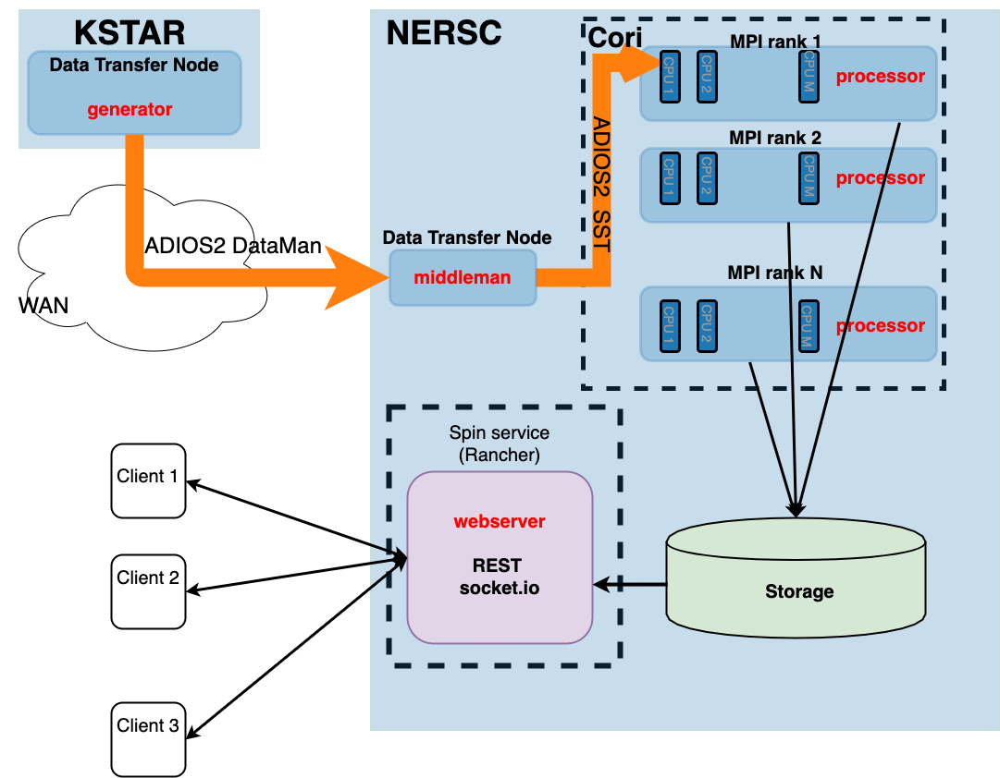

.. Delta-fusion documentation master file, created by
   sphinx-quickstart on Thu Oct 22 11:55:40 2020.
   You can adapt this file completely to your liking, but it should at least
   contain the root `toctree` directive.

Welcome to Delta-fusion's documentation!
========================================
Delta facilitates near real-time streaming analysis of big fusion data on
remote HPC resources. It consists of multiple executables that send,
receive, and process data on different machines. The picture below gives an 
overview of Delta.

    Target architecture of Delta 

At the data generation site, a `generator` reads measurement data from file and stages
it for streaming. The data stream is received by a `middleman` that forwards it 
to the `processor`, which executes data analysis kernels on a supercomputer.
The analysis results are stored and made available to web-clients by a separate
webserver.

This documentation describes the capabilities of `Delta`, how to configure it and
how to launch distributed anaylsis workflows.

Guide
=====

.. toctree::
   :maxdepth: 2
   :caption: Running Delta

   notes/configuring
   notes/launching

Data models
===========

.. toctree::
    :maxdepth: 1
    :caption: Package reference

    modules/data_models

Indices and tables
==================

* :ref:`genindex`
* :ref:`modindex`
* :ref:`search`
