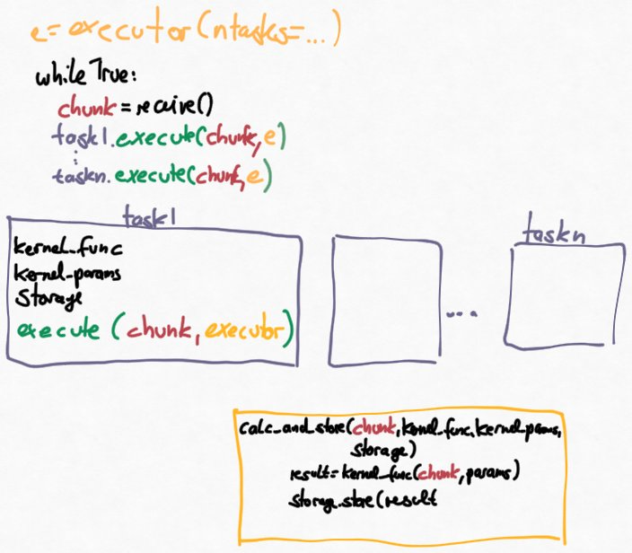

Data analysis
=============

`Delta` performs data analysis by executing `data analysis kernels` on PEP-3148 style
executors to operate on data chunks. Here we introduce the implemented abstractions to 
seamlessly perform streaming data analysis in an HPC environment. 

    Illustration of the implemented launch mechanism for data analysis tasks

The figure above illustrates the layers of the abstracted execution mechanism for data analysis
tasks. The main function instantiates 

    * An `PEP-3148 <https://www.python.org/dev/peps/pep-3148/>`_ compatible executor which will be used to execute analysis kernels. 
    * A list of n :py:class:`analysis.task_base.task_base` objects. Each task is configured as dictated in the configuration file.

In the receive loop, all instantiated tasks are executed on the executor, using the just received data chunk.
Internally, the task objects execute a function :py:func:`analysis.task_base.calc_and_store`, with the
data chunk, their kernel function, kernel parameters and the storage object on the executor.
This additional level of abstraction allows to immediately store the result of the analysis kernels. That is,
there is no need to await the return of executor.submit and the tasks can be launched in a `fire-and-forget`
way. It also makes it possible to launch kernels with different call signatures while still using the
same interface from the main loop.

Actual analysis tasks classes are derived from :py:meth:`analysis.task_base.task_base` and
overload :py:meth:`analysis.task_base.task_base._get_kernel` in order to launch the desired analysis kernel

.. code-block:: python

    class task_derived(task_base):
        def get_kernel(self):
            return my_kernel

The implementation of :py:meth:`analysis.task_base.task_base.execute` is similar to

.. code-block:: python

    class task_base():
        ...

        def execute(chunk, executor):

            _ = executor.submit(self._get_dispatch_func(),
                                self._get_kernel(),
                                self.storage,
                                chunk, **kwargs)

Since both data analysis and storage are handled by the dispatch function, the results of 
the future are not required in the main loop. Data analysis can therefore be performed in a 
"fire-and-forget" way on the compute resource.

By default :py:meth:`analysis.task_base.task_base._get_dispatch_func` returns 
:py:func:`analysis.task_base.calc_and_store`. The relevant portion of this function 
are first, calling the data kernel and second, storing the result once the kernel call
has returned.

.. code-block:: python

    def calc_and_store(kernel, storage, chunk, kwargs, info_dict):
        result = kernel(chunk.data, kwargs, chunk.params)
        storage.store_data(result, info_dict)

    class task_base():
        def _get_dispatch_func():
            return calc_and_store

Derived classes may overload :py:meth:`analysis.task_base.task_base._get_dispatch_func` 
to accomedate custom kernel call signatures.

.. contents:: Contents
    :local:

task_base
---------

.. automodule:: analysis.task_base
    :members:
    :special-members: __init__
    :private-members: _get_kernel, _get_dispatch_func

